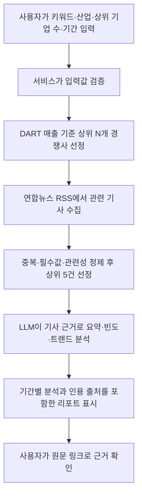
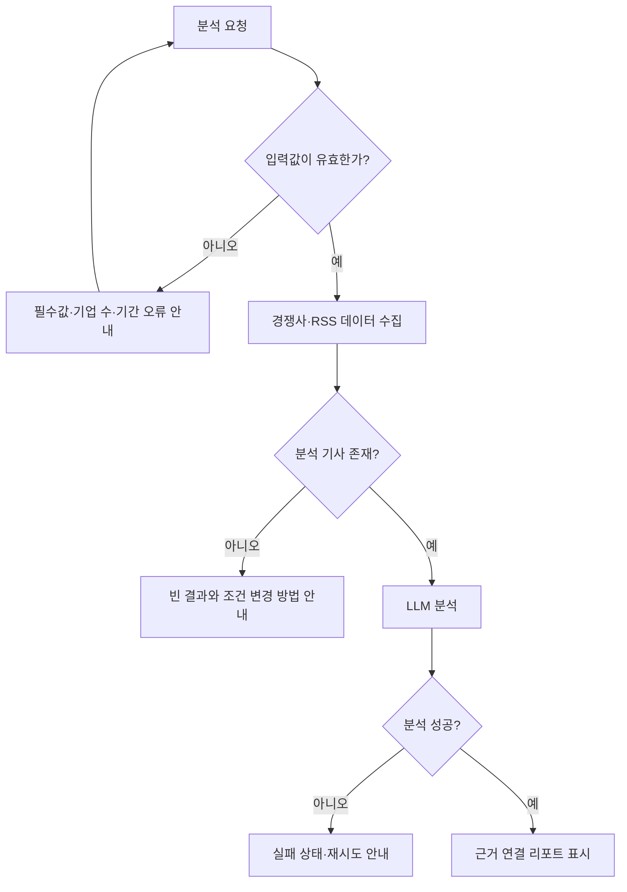

# 뉴스 & 트렌드 리포트 생성기 MVP 계획서

> 상태: 초안  
> 기준 문서: `docs/requirements-zosel.md`, `docs/function-breakdown-zosel.md`  
> 작성일: 2026-07-25

## 1. MVP 목표

| 항목 | 내용 |
| --- | --- |
| 프로젝트명 | 마케터 & 기획자를 위한 「뉴스 & 트렌드 리포트 생성기」 |
| MVP 한 줄 설명 | 사용자가 키워드·산업·상위 기업 수·기간을 입력하면, 시스템이 DART 매출 기준 경쟁사와 연합뉴스 RSS 기사를 바탕으로 근거가 연결된 트렌드 리포트를 보여 주는 최소 실행 버전 |
| 대상 사용자 | 산업과 경쟁사 동향을 빠르게 파악해야 하는 마케터 및 기획자 |
| 검증할 핵심 가치 | 여러 기사를 직접 찾고 비교하는 대신, 사용자가 조건에 맞는 핵심 기사와 트렌드·근거를 한 화면에서 빠르게 확인할 수 있는지 검증한다. LLM 분석은 최종 사실 판정이 아닌 원문 확인을 돕는 참고 정보로 제공한다. |
| 시연 방식 | 키워드와 산업, 상위 기업 수, 기간을 입력한 뒤 분석을 요청하면 경쟁사 목록, 분석 기사 최대 5건, 요약·트렌드·기간별 분석·인용 출처를 순서대로 확인한다. |

## 2. MVP 사용자 흐름

### 2.1 정상 흐름



### 2.2 주요 예외 흐름



## 3. MVP 포함 기능

| 번호 | 기능 | MVP 동작 | 포함 이유 |
| --- | --- | --- | --- |
| 1 | 분석 조건 입력·검증 | 자유 키워드, 산업, 상위 주요 기업 수(N), 기간을 입력받고 필수값·N·날짜를 검증한다. 기본 기간은 최근 한 달이며 허용 범위는 1주일~3개월이다. | 분석 범위를 사용자가 정하는 시작점이다. |
| 2 | DART 기반 경쟁사 선정 | 최근 사업연도 연결 재무제표 매출액을 기준으로 선택 산업의 상위 N개 기업을 선정하고 기준 사업연도·매출액을 보여 준다. | 경쟁사 범위를 일관된 공개 기준으로 정한다. |
| 3 | 연합뉴스 RSS 기사 수집 | 키워드·경쟁사·기간에 맞는 RSS 기사의 제목, 발행일, 언론사명, 원문 URL, 제공 텍스트를 수집한다. | 분석 근거가 되는 공개 데이터를 확보한다. |
| 4 | 기사 정제·최대 5건 선정 | 중복 URL을 제거하고 키워드 또는 경쟁사 관련 기사를 남긴 뒤 검색 노출 순서의 상위 5건을 분석한다. 5건 미만이면 수집된 전체를 사용한다. | 분석 범위·비용을 제한하면서 핵심 기사를 우선 검증한다. |
| 5 | LLM 요약·트렌드 분석 | 선정 기사만 근거로 기사 요약, 키워드 출현 빈도, 반복 변화와 트렌드를 생성하며 각 주장에 근거 기사 ID를 연결한다. | 사용자가 핵심 맥락을 빠르게 파악하게 한다. |
| 6 | 기간별 분석 | 최근 한 달이면 1~4주차 변화를, 그 밖의 기간이면 전체 기간 요약을 표시한다. 기사 없는 주차는 빈 상태로 표시한다. | 시간에 따른 변화를 읽을 수 있게 한다. |
| 7 | 리포트·출처 표시 | 전체 요약, 트렌드, 기간별 분석, 경쟁사·기사 목록, 인용 출처, 분석 설정을 한 화면에 표시하고 원문 링크를 제공한다. | 결과의 이해와 근거 확인을 지원한다. |
| 8 | 상태·오류 안내 | 입력 오류, 수집 중, 빈 결과, 부분 결과, 분석 실패 상태와 다음 행동을 안내한다. | 실패해도 화면이 중단되지 않도록 한다. |

### 필수 출력 형식

```text
설정 키워드: {키워드}
산업: {산업} | 상위 주요 기업: {N}개 | 검색 기간: YYYY-MM-DD ~ YYYY-MM-DD | 빈도수: N회
```

`빈도수`는 최종 분석에 사용된 RSS 기사 수이며, 각 인용·출처에는 언론사명(연합뉴스), 기사 제목, 발행일, 원문 URL을 포함한다.

## 4. MVP에서 제외하는 기능

| 기능 | 제외 이유 | 후순위 조건 |
| --- | --- | --- |
| 로그인·사용자별 저장·관리자 기능 | 단일 분석 흐름 검증에 필수 기능이 아니다. | 사용자별 이력·권한 요구가 확정된 뒤 추가 |
| PDF 다운로드·이메일·메신저 공유 | 리포트 생성과 근거 확인이 먼저 검증되어야 한다. | 결과 형식과 공유 권한 정책 확정 후 추가 |
| 여러 뉴스 출처·유료 데이터 | 출처별 이용 조건, 형식, 품질 검증이 필요하다. | 연합뉴스 RSS 흐름이 안정화된 뒤 추가 |
| 전체 기사 대량 분석·개인화 추천 | 비용·성능·추천 기준을 별도로 설계해야 한다. | 상위 5건 분석의 유용성 검증 후 추가 |
| OCR·이미지·표 정밀 분석 | 텍스트 RSS 분석과 다른 처리 품질 기준이 필요하다. | 데이터 범위와 품질 기준 확정 후 추가 |
| 고급 원문 하이라이트 | 기사 구조별 위치 계산과 화면 설계가 추가로 필요하다. | 리포트 화면 사용성 검증 후 추가 |

## 5. 구현 우선순위

| 순서 | 작업 | 결과물 | 확인 방법 |
| --- | --- | --- | --- |
| 1 | 분석 요청 모델·입력 검증 | 키워드, 산업, N, 시작일·종료일 검증 규칙 | 필수값 누락, N 비숫자, 7일 미만·3개월 초과 입력을 거부하는지 확인 |
| 2 | 경쟁사 선정 데이터 흐름 | 산업별 상위 N개 기업·매출·기준 연도 | N보다 적은 기업만 있을 때 부분 결과를 안내하는지 확인 |
| 3 | RSS 수집·기사 정제 | 표준 기사 데이터와 중복 제거·관련성 판정 | URL 중복, 필수 필드 누락, 기사 0건을 구분하는지 확인 |
| 4 | 분석 대상 선정 | 최대 5건의 선정 기사 목록과 실제 분석 건수 | 3건이면 3건 전체를 사용하고 부족 사실을 표시하는지 확인 |
| 5 | LLM 분석 형식·근거 연결 | 요약, 빈도, 트렌드, 근거 기사 ID | 근거 없는 생성 내용이 화면에 표시되지 않는지 확인 |
| 6 | 기간별 리포트 화면 | 최근 한 달의 1~4주차 또는 전체 기간 요약 | 빈 주차와 원문 링크를 확인 |
| 7 | 상태·오류 화면 및 통합 테스트 | 입력 오류·수집 실패·분석 실패 안내 | 실패해도 기존 화면이 중단되지 않는지 확인 |

## 6. 완료 기준

| 기준 | 사용자 확인 결과 |
| --- | --- |
| 분석 조건 입력 | 사용자가 키워드, 산업, 상위 기업 수, 1주일~3개월 기간을 입력하고 분석을 시작할 수 있다. |
| 경쟁사·기사 수집 | 선택 산업의 DART 매출 기준 상위 N개와 조건에 맞는 연합뉴스 RSS 기사를 확인할 수 있다. |
| 분석 결과 | 기사 최대 5건을 바탕으로 전체 요약, 키워드 빈도, 하나 이상의 트렌드를 확인할 수 있다. |
| 기간별 표시 | 최근 한 달은 1~4주차별 결과 또는 빈 상태를, 다른 기간은 전체 요약을 확인할 수 있다. |
| 근거 확인 | 리포트의 요약·트렌드에서 기사 출처와 원문 링크를 확인할 수 있다. |
| 오류 처리 | 유효하지 않은 입력, 기사 없음, RSS·LLM 실패 시 완료 결과처럼 보이지 않고 이유와 다음 행동을 안내한다. |
| 실행 안내 | README에 실행 방법, 정상·오류 입력 예시, 기대 결과를 기록한다. |

## 7. 최소 테스트 시나리오

| ID | 시나리오 | 기대 결과 |
| --- | --- | --- |
| TC-01 | 정상 조건으로 최근 한 달 분석 요청 | 경쟁사, 최대 5개 기사, 요약·트렌드·1~4주차·설정 정보·출처가 표시된다. |
| TC-02 | 키워드 또는 산업을 비워 요청 | 분석을 시작하지 않고 해당 입력 항목의 수정 방법을 안내한다. |
| TC-03 | 7일 미만 또는 3개월 초과 기간 입력 | 기간 범위를 안내하고 요청을 막는다. |
| TC-04 | 요청한 N보다 적은 경쟁사만 조회됨 | 가능한 기업만 표시하고 부분 결과 이유를 표시한다. |
| TC-05 | 같은 원문 URL의 기사가 반복 수집됨 | 중복 기사는 한 번만 분석 대상에 포함된다. |
| TC-06 | 관련 기사가 3건만 수집됨 | 3건 전체를 분석하고 실제 분석 기사 수를 빈도수로 표시한다. |
| TC-07 | 관련 기사가 0건 | LLM을 호출하지 않고 빈 결과·조건 변경 안내를 표시한다. |
| TC-08 | 한 주차에 기사가 없음 | 해당 주차에 빈 상태를 표시하고 나머지 주차 결과는 유지한다. |
| TC-09 | LLM 분석 실패 | 실패 사유와 재시도 안내를 표시하며 리포트를 완료 상태로 표시하지 않는다. |
| TC-10 | 원문 출처 링크 선택 | 유효한 링크는 새 탭에서 열리고, 누락 링크는 비활성 안내가 표시된다. |

## 8. 구현 전 확정이 필요한 항목

| 항목 | 결정 내용 | 영향 범위 |
| --- | --- | --- |
| 산업 분류 | 사용자 산업 선택값과 DART 기업을 연결할 분류 체계·관리 방식 | 경쟁사 선정 |
| DART 수집 방식 | Open DART API 사용 여부, 데이터 갱신 규칙 | 환경 변수, 경쟁사 선정 |
| RSS 검색 방식 | 키워드·기업명 검색이 가능한 RSS URL 또는 조회 규칙 | RSS 수집 |
| 검색 노출 순서 | RSS 응답 순서와 서비스 검색 결과 순서 중 적용 기준 | 상위 5건 선정 |
| LLM 설정 | 모델, 비용·시간 제한, 구조화 응답 형식 | 분석 기능, 환경 변수 |
| 주차 경계 | 최근 한 달을 달력 주차 또는 종료일 기준 7일 단위로 나눌지 | 기간별 분석 |

위 항목은 구현 전에 결정하되, 현재 확정된 데이터 출처·분석 기준·출력 기준은 변경하지 않는다.
