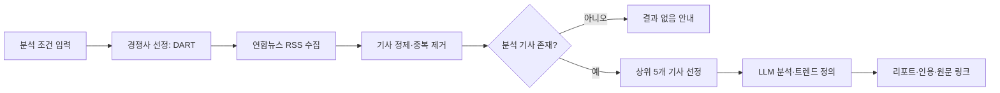

# 뉴스 & 트렌드 리포트 생성기 기능 분해표

> 상태: 초안  
> 기준 문서: `docs/requirements-zosel.md`  
> 작성일: 2026-07-25

## 1. 목적과 MVP 범위

마케터와 기획자가 키워드·산업·상위 기업 수·검색 기간을 설정하면, 시스템은 DART 매출 기준 경쟁사와 연합뉴스 RSS 기사를 바탕으로 근거가 연결된 한국어 트렌드 리포트를 만든다.

MVP는 **입력 → 경쟁사 선정 → RSS 수집·정제 → 상위 5개 기사 선정 → LLM 분석 → 리포트·출처 표시** 흐름만 다룬다. 로그인, 리포트 저장·공유, 알림, 관리자 기능은 제외한다.

### 1.1 기능 경계

| 구분 | MVP에 포함 | MVP에서 제외 |
| --- | --- | --- |
| 데이터 출처 | DART 사업보고서, 연합뉴스 RSS | 다른 언론사·유료 데이터·소셜 데이터 |
| 분석 대상 | 검색 노출 상위 5개 기사(부족 시 확보된 전체) | 전체 기사 심층 분석, 사용자별 추천 |
| 결과 제공 | 화면 리포트, 원문 링크, 인용·출처 | PDF 다운로드, 이메일·메신저 전송, 저장·공유 |
| 사용자 기능 | 분석 조건 입력과 결과 확인 | 로그인, 권한, 개인 이력 |

### 1.2 공통 용어와 결정 기준

| 항목 | 기준 |
| --- | --- |
| 분석 요청 | 사용자가 입력한 키워드, 산업, 상위 주요 기업 수, 검색 기간의 묶음 |
| 경쟁사 | 선택 산업에서 DART 최근 사업연도 연결 재무제표 매출액이 높은 순서의 기업 |
| 기사 중복 | 원문 URL이 같으면 같은 기사로 판단한다. URL이 없으면 제목과 발행일이 모두 같은 항목을 중복으로 본다. |
| 키워드 매칭 | 자유 입력 키워드와 선정 경쟁사명을 제목·RSS 요약 또는 제공 본문에서 찾는다. 대소문자·앞뒤 공백은 정규화한다. |
| 분석 기사 수 | 정제·중복 제거 뒤 검색 노출 순서를 유지한 앞 5건이다. |
| 빈도수 | 최종 분석에 실제 사용된 RSS 기사 수이다. |
| 최근 한 달 | 요청일을 종료일로 하여 직전 한 달을 포함하는 기간이며, 화면에서는 4개 주차로 나눈다. |

## 2. 전체 기능 분해 요약

| 대분류 | 세부 기능 | 입력 | 처리 | 출력 | 우선순위 |
| --- | --- | --- | --- | --- | --- |
| 화면 | 분석 조건 입력 | 키워드, 산업, N, 기간 | 기본값 표시·유효성 검사 | 분석 요청 또는 오류 안내 | 높음 |
| 데이터 | 경쟁사 선정 | 산업, N | DART 매출 데이터 조회·정렬 | 상위 N개 기업과 매출 기준 | 높음 |
| 데이터 | RSS 기사 수집 | 키워드, 경쟁사, 기간 | 연합뉴스 RSS 조회·기간 필터 | 원본 기사 목록 | 높음 |
| 데이터 | 기사 정제·선정 | 원본 기사 목록 | 필수값 검사·중복 제거·매칭·상위 5건 선정 | 분석용 기사 묶음 | 높음 |
| AI | 기사 요약·빈도 분석 | 분석용 기사 묶음, 설정 | 기사 근거 기반 요약·키워드 빈도·트렌드 생성 | 구조화 분석 결과 | 높음 |
| 화면 | 리포트·출처 표시 | 분석 결과, 설정, 기사 목록 | 기간별 결과와 인용 연결 | 읽기 쉬운 리포트 | 높음 |
| 공통 | 상태·오류 처리 | 단계별 성공·실패 정보 | 안전한 상태 전이와 안내 | 빈 상태·오류 화면 | 높음 |
| 테스트 | 핵심 흐름 검증 | 정상·경계·실패 입력 | 기능 및 연계 테스트 | 테스트 결과 | 높음 |

## 3. 기능별 상세 설계

### F-01. 분석 조건 입력 및 요청 생성

| 구분 | 내용 |
| --- | --- |
| 목적 | 분석에 필요한 조건을 빠짐없이 받고, 유효한 요청만 후속 단계로 전달한다. |
| 입력 | 자유 입력 키워드, 산업, 상위 주요 기업 수(N), 검색 시작일·종료일 또는 기간 선택 |
| 처리 | 키워드·산업·N의 필수 여부를 확인하고, 기본 기간을 최근 한 달로 채운다. 기간은 7일 이상 3개월 이하인지 확인하고 시작일이 종료일보다 빠른지 검증한다. |
| 출력 | 정규화된 `analysisRequest`(키워드, 산업, N, 시작일, 종료일) 또는 입력 오류 메시지 |
| 예외 처리 | 필수값 누락, 숫자가 아닌 N, 허용 기간 이탈, 잘못된 날짜 순서는 요청을 시작하지 않고 해당 입력 항목의 수정 방법을 안내한다. |
| 완료 조건 | 유효한 조건이 확정되고 분석 시작 요청이 생성된다. |

**화면 요소:** 키워드 입력란, 산업 선택 또는 입력란, 상위 기업 수 입력란, 기간 선택기, 최근 한 달 기본값, 분석 시작 버튼, 항목별 오류 문구.

### F-02. DART 기반 경쟁사 선정

| 구분 | 내용 |
| --- | --- |
| 목적 | 사용자가 선택한 산업의 분석 범위를 매출 기준 상위 N개 기업으로 일관되게 정한다. |
| 입력 | 산업, 상위 주요 기업 수(N) |
| 처리 | 산업 분류에 해당하는 DART 사업보고서 데이터를 찾고, 최근 사업연도 연결 재무제표의 매출액을 비교해 내림차순 정렬한다. 상위 N개를 선택하고 기준 사업연도·매출액을 함께 보관한다. |
| 출력 | `competitorSet`: 기업명, 매출액, 기준 사업연도, 정렬 순위 |
| 예외 처리 | 산업 매핑 실패, DART 응답 실패, 연결 매출액 누락, N보다 적은 기업만 확보된 경우를 구분한다. 확보 가능한 기업만 쓸 때는 수와 사유를 리포트에 경고로 표시한다. 데이터가 전혀 없으면 후속 RSS·분석을 시작하지 않는다. |
| 완료 조건 | 기업별 매출 기준을 확인 가능한 경쟁사 목록이 생성된다. |

### F-03. 연합뉴스 RSS 기사 수집

| 구분 | 내용 |
| --- | --- |
| 목적 | 설정 키워드·경쟁사·기간과 관련된 신뢰 가능한 1차 기사 목록을 확보한다. |
| 입력 | 키워드, 경쟁사명 목록, 시작일, 종료일 |
| 처리 | 연합뉴스 RSS를 조회하고 발행일로 기간을 제한한다. 각 RSS 항목에서 제목, 발행일, 언론사명, 원문 URL, 제공되는 요약 또는 본문 범위를 추출한다. |
| 출력 | `rawArticles`: RSS 원본 식별값과 추출한 기사 필드 |
| 예외 처리 | RSS 접속·파싱 실패는 오류 상태로 남기고 안전한 안내를 표시한다. URL·발행일 등 일부 필드가 없으면 해당 사유를 기록하며, 분석 필수 필드가 없는 항목은 선정 대상에서 제외한다. |
| 완료 조건 | 원문 URL과 발행일을 포함한 기사 후보 목록 또는 빈 목록이 생성된다. |

### F-04. 기사 정제·관련성 판정·상위 5개 선정

| 구분 | 내용 |
| --- | --- |
| 목적 | 동일 기사와 분석 근거가 부족한 항목을 제거하고, 요구사항에 맞는 분석 대상을 확정한다. |
| 입력 | `rawArticles`, 키워드, 경쟁사명 목록 |
| 처리 | 제목·요약·제공 본문을 정규화하고 중복을 제거한다. 키워드 또는 경쟁사명과 매칭되는 기사를 남긴 뒤 RSS 검색 노출 순서를 보존하여 앞 5건을 선정한다. |
| 출력 | `selectedArticles`, 제외 사유별 집계(중복·필수값 누락·관련성 없음), 실제 분석 기사 수 |
| 예외 처리 | 5건 미만이면 확보된 전체를 분석하고 부족 사실을 표시한다. 0건이면 LLM 호출 없이 빈 결과 상태로 전환한다. |
| 완료 조건 | 기사별 제목·발행일·언론사·원문 URL이 있는 최대 5건의 분석 대상이 확정된다. |

### F-05. LLM 기반 기사 분석 및 트렌드 정의

| 구분 | 내용 |
| --- | --- |
| 목적 | 선정 기사만 근거로 핵심 내용을 요약하고 키워드 출현 빈도를 바탕으로 트렌드를 정의한다. |
| 입력 | `selectedArticles`, 분석 설정, 주차 구분 정보 |
| 처리 | 기사마다 제공된 RSS 제목·요약·본문 범위만 LLM에 전달한다. 기사 요약, 키워드 출현 빈도, 반복되는 변화·이슈를 생성하고 각 주장에 근거 기사 ID를 연결한다. 사실 요약과 해석·트렌드 정의를 구분한다. |
| 출력 | `analysisResult`: 전체 요약, 기사별 요약, 키워드 빈도, 트렌드 목록, 근거 기사 ID, 주차별 결과(최근 한 달일 때) |
| 예외 처리 | LLM 호출 실패·시간 초과·형식 오류 시 내부 오류를 노출하지 않고 분석 실패를 안내한다. 근거 기사 ID가 없는 생성 내용은 표시하지 않는다. |
| 완료 조건 | 하나 이상의 근거 연결된 요약·트렌드가 생성되거나, 생성 불가 사유가 안전하게 기록된다. |

### F-06. 기간별 분석 구성

| 구분 | 내용 |
| --- | --- |
| 목적 | 최근 한 달 리포트에서 시간에 따른 변화를 쉽게 비교하게 한다. |
| 입력 | 선택 기간, `selectedArticles`, `analysisResult` |
| 처리 | 최근 한 달인 경우 기간을 1~4주차로 나누어 기사와 분석 결과를 배치한다. 그 외 기간은 전체 기간 분석으로 구성한다. |
| 출력 | `periodAnalysis`: 주차별 분석 또는 기간 전체 요약 |
| 예외 처리 | 특정 주차에 기사가 없으면 임의의 추론 대신 “해당 주에 분석 대상 기사가 없습니다”를 표시한다. |
| 완료 조건 | 선택 기간 규칙에 맞는 시간 단위의 분석 영역이 만들어진다. |

### F-07. 리포트·인용·원문 링크 표시

| 구분 | 내용 |
| --- | --- |
| 목적 | 사용자가 결과를 빠르게 읽고 각 주장에 대한 원문 근거를 확인하게 한다. |
| 입력 | 분석 설정, 경쟁사 목록, `analysisResult`, `periodAnalysis`, `selectedArticles` |
| 처리 | 전체 요약, 키워드 빈도, 트렌드, 기간별 분석, 근거 기사 목록을 정해진 순서로 표시한다. 주장·요약의 근거 기사 ID를 기사 메타데이터와 연결하고, 원문 URL은 새 탭 또는 페이지에서 열도록 제공한다. |
| 출력 | 웹 리포트 화면 |
| 예외 처리 | 기사 URL이 누락되었거나 유효하지 않으면 링크 버튼을 비활성화하고 출처 정보만 표시한다. 부분 결과·기업 수 부족·기사 부족은 경고 문구로 명확히 구분한다. |
| 완료 조건 | 모든 표시 내용이 출처 또는 빈 상태 안내와 함께 제공된다. |

**필수 표시 형식**

```text
설정 키워드: {키워드}
산업: {산업} | 상위 주요 기업: {N}개 | 검색 기간: YYYY-MM-DD ~ YYYY-MM-DD | 빈도수: N회
```

**기사 출처 표시 항목:** 언론사명(연합뉴스), 기사 제목, 발행일, 원문 URL.

### F-08. 공통 상태·오류 처리

| 상태 | 발생 조건 | 사용자 표시 및 다음 행동 |
| --- | --- | --- |
| 입력 오류 | 조건 검증 실패 | 분석을 시작하지 않고 입력값 수정 방법을 표시 |
| 수집 중 | 경쟁사 선정 또는 RSS 수집 진행 중 | 진행 상태를 표시 |
| 결과 없음 | 관련 기사가 0건 | 기사 없음과 설정 변경 가능성을 안내, LLM 호출은 하지 않음 |
| 부분 결과 | 기업·기사 수가 요청보다 적음, 일부 필드 누락 | 확보된 범위와 제한 사항을 결과와 함께 표시 |
| 분석 실패 | LLM 또는 데이터 처리 실패 | 내부 오류·민감정보 없이 재시도 또는 조건 변경을 안내 |
| 완료 | 근거 연결된 리포트 생성 완료 | 리포트와 원문 링크 표시 |

## 4. 기능 연결 및 데이터 흐름



### 4.1 단계 간 전달 데이터

| 선행 기능 | 다음 기능 | 전달 데이터 | 차단 조건 |
| --- | --- | --- | --- |
| F-01 | F-02 | 산업, N | 필수값·기간 검증 실패 |
| F-02 | F-03 | 경쟁사명 목록, 기준 사업연도 | 경쟁사 데이터 0건 |
| F-03 | F-04 | 원본 기사 목록, 설정 | RSS 수집 실패(빈 결과와 구분) |
| F-04 | F-05 | 최대 5건의 분석 기사, 실제 기사 수 | 분석 기사 0건 |
| F-05 | F-06/F-07 | 근거 연결 분석 결과 | LLM 실패·근거 없는 결과 |
| F-06 | F-07 | 주차별 또는 전체 기간 결과 | 없음(빈 주차는 표시 가능) |

## 5. 화면 및 API 경계

초기 구현에서는 화면과 서버의 역할을 다음처럼 분리한다. 실제 엔드포인트와 데이터 모델 이름은 프로젝트 구조를 만든 뒤 확정한다.

| 구분 | 화면 역할 | 서버·분석 역할 |
| --- | --- | --- |
| 분석 요청 | 조건 입력, 검증 오류·진행 상태 표시 | 요청 검증, 분석 작업 시작 |
| 경쟁사 | 기업·매출 기준 표시 | DART 데이터 조회·정렬 |
| 기사 | 기사 수·부족 상태 표시 | RSS 조회, 정제, 중복 제거, 상위 5건 선정 |
| 분석 | 결과·실패 상태 표시 | LLM 호출, 근거 연결, 기간별 데이터 생성 |
| 리포트 | 요약·출처·원문 링크 렌더링 | 구조화 결과와 안전한 오류 정보 반환 |

## 6. 테스트 계획 및 수용 기준

| ID | 시나리오 | 기대 결과 | 관련 기능 |
| --- | --- | --- | --- |
| TC-01 | 모든 유효 조건으로 최근 한 달 분석을 요청한다. | 경쟁사, 최대 5개 기사, 전체·주차별 분석, 설정 정보가 표시된다. | F-01~F-07 |
| TC-02 | 키워드 또는 산업을 비운다. | 분석이 시작되지 않고 필수 입력 안내가 표시된다. | F-01 |
| TC-03 | 기간을 7일 미만 또는 3개월 초과로 설정한다. | 분석이 시작되지 않고 기간 범위 안내가 표시된다. | F-01 |
| TC-04 | 요청 N보다 적은 경쟁사만 조회된다. | 확보된 기업 수와 제한 사유를 경고로 표시한다. | F-02 |
| TC-05 | RSS에서 같은 원문 URL의 기사가 반복된다. | 하나의 기사만 분석 대상에 남는다. | F-04 |
| TC-06 | 유효한 관련 기사가 3건이다. | 3건 전체를 분석하고 “5건 미만” 상태와 빈도수 3회를 표시한다. | F-04, F-07 |
| TC-07 | 관련 기사가 없다. | LLM을 호출하지 않고 결과 없음 안내를 표시한다. | F-04, F-08 |
| TC-08 | 최근 한 달 중 한 주차에 기사가 없다. | 해당 주차에 빈 상태를 표시하고 다른 주차 결과는 유지한다. | F-06 |
| TC-09 | LLM 분석이 실패한다. | 기존 화면이 중단되지 않고 안전한 실패 안내가 표시된다. | F-05, F-08 |
| TC-10 | 리포트의 주장 또는 요약을 확인한다. | 각 항목에서 연결된 연합뉴스 기사 제목·발행일·원문 URL을 확인할 수 있다. | F-07 |
| TC-11 | 원문 링크를 연다. | 유효한 URL은 새 탭 또는 페이지에서 열리고, 누락 URL은 비활성 안내가 표시된다. | F-07 |

## 7. 권장 구현 순서

1. 분석 요청 데이터와 입력 검증 규칙(F-01)을 만든다.
2. DART 산업·매출 데이터의 수집 범위와 경쟁사 선정 결과(F-02)를 검증한다.
3. 연합뉴스 RSS 수집·정제·중복 제거·상위 5개 선정(F-03~F-04)을 구현한다.
4. 기사 묶음을 입력으로 하는 LLM 분석 결과 형식과 근거 연결(F-05)을 구현한다.
5. 최근 한 달 주차 구분과 리포트·출처 화면(F-06~F-07)을 연결한다.
6. 빈 결과·실패·부분 결과 상태(F-08)와 테스트를 보완한다.

## 8. 후속 확정이 필요한 항목

| 항목 | 필요한 결정 | 영향 범위 |
| --- | --- | --- |
| 산업 분류 | 사용자 선택 산업과 DART 기업을 연결하는 분류표의 출처·관리 방식 | F-01, F-02 |
| DART 수집 방식 | Open DART API 사용 여부, 사업보고서 식별·갱신 규칙 | F-02, 환경 변수 |
| RSS 검색 방식 | 연합뉴스 RSS에서 키워드·기업별 결과를 얻는 구체적 URL·조회 제약 | F-03 |
| 검색 노출 순서 | RSS 응답 순서를 그대로 사용할지, 서비스 검색 결과 순서가 있으면 그것을 쓸지 | F-04 |
| LLM 제공자·모델 | 사용할 API, 비용·시간 제한, 구조화 응답 형식 | F-05, 환경 변수 |
| 주차 경계 | 최근 한 달을 달력 주차로 나눌지, 종료일 기준 7일 단위로 나눌지 | F-06 |

이 항목들은 MVP 구현 전에 결정하되, 현재 요구사항의 데이터 출처·분석 기준·출력 기준은 변경하지 않는다.
